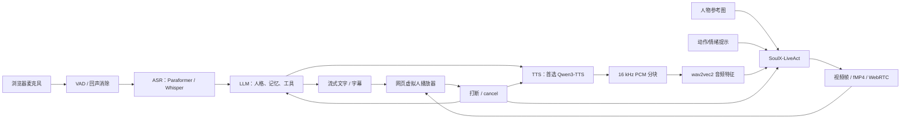
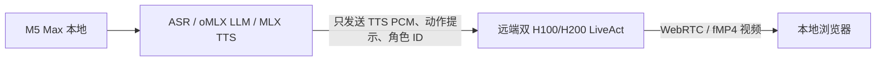
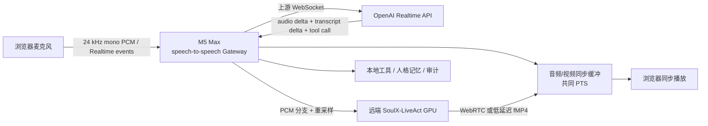

# 虚拟人技术逆向与实施计划

更新时间：2026-07-25

## 一、结论先行

参考视频中的效果，高概率不是 3D 建模、Live2D 或传统口型贴图，而是：

> 单张人物参考图 + TTS 语音 → SoulX-LiveAct 音频驱动的自回归扩散视频 → 网页端播放

完整“能对话的虚拟人”还需要另一条语音智能链路：

> 麦克风 → VAD → ASR/STT → LLM → TTS → SoulX-LiveAct → 视频流

三张资料图指向的是两套需要自行集成的开源系统，而不是一个开箱即用的完整产品：

1. [Hugging Face speech-to-speech](https://github.com/huggingface/speech-to-speech)：负责 VAD、语音识别、LLM、TTS、WebSocket 实时协议和打断。
2. [SoulX-LiveAct](https://github.com/Soul-AILab/SoulX-LiveAct)：负责把人物图和语音变成连续人物视频。

`OmniVoice / LongCat-AudioDiT / Qwen3-TTS` 是三种可替换的 TTS 方案，不需要同时运行。对于第一版，优先选择已经被 `speech-to-speech` 支持、并明确支持流式生成的 `Qwen3-TTS`。

### 2026-07-25 执行校正

对两套官方推理循环逐行检查并完成本机网络联调后，人物端调整为双路径：

- **实时通话主路径：SoulX-FlashHead Lite**。官方循环保留上一段运动状态，约每 0.96 秒消费一块新音频；单 RTX 4090 官方指标可达到 96 FPS 或三路 25+ FPS。它更适合参考视频这种近景人物持续聊天。
- **高动态画质路径：SoulX-LiveAct**。保留半身、手势、动作提示与更长视频能力；官方 demo 首块需要约 53 帧音频上下文并先读取完整 WAV，因此当前用于回答完成后的画质验收，不能冒充低延迟增量接口。

项目已经实现 FlashHead 原生流式 GPU worker、LiveAct 官方接口适配器、OpenAI Realtime 网关、
连续 fragmented MP4/MediaSource、分段降级、共同 PTS、打断清理和 A/V 漂移验收。M5 Max 上
已通过真实 WebSocket 传输连续 fMP4，并以浏览器 `blob:` URL 播放；模拟链路首播放约 1.36 秒。
兼容路径使用 1.0 + 1.0 + 0.4 秒三个带音轨视频段，每段测得音视频时长漂移接近 0 ms。

## 二、素材证据与逆向判断

### 1. 三张图片分别说明了什么

| 图片 | 可确认的信息 | 对项目的意义 |
|---|---|---|
| 图 1 | TTS 候选是 OmniVoice、LongCat AudioDiT、Qwen3-TTS；OmniVoice 支持 `[laughter]`、`[sigh]`、`[question-*]`、`[surprise-*]` 等非语言标签 | TTS 决定音色、情绪和语气，LiveAct 再根据音频表现嘴型和面部动作 |
| 图 2 | SoulX-LiveAct、CUTLASS、LightX2V/LightVAE、`wav2vec`、双 CUDA 设备、416×720、FP4 GEMM、FP8 KV cache | 视频端是主要算力瓶颈；博主运行的不是普通 CPU/单卡轻量方案 |
| 图 3 | `huggingface/speech-to-speech` 仓库 | 对话前半段很可能采用现成的开源级联语音 Agent 管线 |

图 2 的 `webui_stable.py` 和页面里的自定义 UI 并不是 SoulX-LiveAct 主仓库原版入口。官方主仓库提供的是 `generate.py` 和 `demo.py`，所以博主还做了一层私有或二次开发封装。

### 2. 对参考视频的本地分析

素材参数：

- 视频总长约 23.03 秒。
- 拍摄文件是 1920×1080、30 FPS；这是“手机拍显示器”的成片规格，不代表虚拟人模型直接生成 1080p。
- 资料图明确使用 `--size 416*720`，因此显示器中的人物流很可能只是 416×720，再由浏览器放大显示。

画面表现：

- 人物是半身、深色背景、正脸偏侧、手托脸的低运动构图。
- 说话时嘴型连续变化；本地音轨转写显示 0–16 秒有五段话，画面在句间停顿时大多闭嘴，在发声段张嘴。
- 眨眼、眼神、眉毛、轻微头动会随语音情绪改变，不只是嘴部区域贴图。
- 手、肩、衣服和背景总体稳定，说明参考图和历史 latent/KV 对身份与构图约束较强。
- 没有看到 3D 网格、骨骼蒙皮或 Live2D 参数化形变的典型特征；结合已给工具，可以高置信判断为单图音频驱动的生成式视频。
- 视频是手机拍屏，存在拍摄位移、摩尔纹和压缩，因此不能据此可靠测出真实唇音延迟、首帧延迟或帧率。
- 底部白黄字幕跨越显示器边框，是博主后期剪辑字幕，不是网页 UI 的可靠证据。
- 约 16–22 秒影视画面切走了整个手机拍屏画面，随后又切回，属于成片剪辑插入，不应纳入虚拟人产品功能范围。

参考帧：

- [UI 画面](./分析素材/ui-frame.jpg)
- [8–16 秒人物连续帧](./分析素材/avatar-08-16.jpg)
- [说话与停顿时的面部对照](./分析素材/face-speech-pauses.jpg)

## 三、SoulX-LiveAct 为什么能做到这种效果

官方论文和代码显示，它基于 Wan2.1 I2V 体系，模型规模约 18B/19B，核心不是逐帧独立生成，而是按块自回归地生成后续视频。

主要机制：

1. **参考图条件**
   - CLIP 提取人物外观和构图。
   - VAE 把参考图和视频块编码到 latent 空间。

2. **语音条件**
   - 中文 `wav2vec2` 把 16 kHz 音频转为特征。
   - 模型通过 audio cross-attention 把音素、节奏和情绪注入脸部及身体运动。

3. **文字/动作条件**
   - T5 编码“一个人在自然说话”等主提示词。
   - `edit_prompt` 可以在指定时间块切换“点头、睁大眼睛、苦笑、挥手”等动作/表情。
   - 官方示例格式见 [example.json](https://raw.githubusercontent.com/Soul-AILab/SoulX-LiveAct/main/examples/example.json) 和 [example_edit.json](https://raw.githubusercontent.com/Soul-AILab/SoulX-LiveAct/main/examples/example_edit.json)。

4. **Neighbor Forcing**
   - 使用相邻帧在同一扩散步骤下的 latent 作为连续条件，降低自回归视频长期漂移和训练不稳定。

5. **ConvKV Memory**
   - 保留近期 KV，把更老的 KV 压缩成固定大小长期记忆，使显存和单块耗时不会随视频长度无限增长。

6. **推理加速**
   - 4 步蒸馏、序列并行、SageAttention、算子融合、LightVAE、`torch.compile`。
   - FP8 KV cache 减少显存；FP4 GEMM 面向 Blackwell/B 系列硬件。
   - 官方 `demo.py` 把生成帧交给 FFmpeg，编码 H.264，并输出 1 秒 HLS 分片。

官方资料：

- [SoulX-LiveAct 论文](https://arxiv.org/abs/2603.11746)
- [SoulX-LiveAct 官方仓库](https://github.com/Soul-AILab/SoulX-LiveAct)
- [模型权重与说明](https://huggingface.co/Soul-AILab/LiveAct)
- [LightX2V](https://github.com/ModelTC/LightX2V)

## 四、TTS 选择

| 方案 | 优点 | 局限 | 本项目建议 |
|---|---|---|---|
| [Qwen3-TTS](https://github.com/QwenLM/Qwen3-TTS) | 官方支持流式、语音克隆、VoiceDesign、自然语言情绪控制；`speech-to-speech` 已有后端 | 单独环境较稳妥；模型和视频模型同时占 GPU | 第一版首选 |
| [OmniVoice](https://github.com/k2-fsa/OmniVoice) | 600+ 语言、零样本克隆、非语言标签、官方声称最低 RTF 0.025 | 是否能达到低首包延迟仍需实测；情绪标签需要 LLM 正确插入 | 第二轮 A/B 测试，适合“赛博女友”的笑、叹气、疑问语气 |
| [LongCat-AudioDiT](https://github.com/meituan-longcat/LongCat-AudioDiT) | 中英文声音相似度和克隆质量强；MIT | 官方示例以完整音频的扩散推理为主，实时流式链路不如 Qwen3 清晰 | 高质量离线/半实时备选 |

建议不要在 LiveAct 的 Python 3.10 环境里直接混装三套 TTS。采用独立 Conda 环境或容器，通过 WebSocket/HTTP 传 PCM，可避免 PyTorch、Transformers 和 CUDA 依赖互相冲突。

## 五、推荐系统架构



部署时把它拆成三个服务：

1. **Voice Agent 服务**：`speech-to-speech`，管理 VAD、ASR、LLM、打断和会话。
2. **TTS 服务**：独立加载一个 TTS 模型，输出流式 PCM。
3. **Avatar 服务**：SoulX-LiveAct 常驻 GPU，预热后接收参考图、PCM 和动作提示，输出视频块。

第一版可以使用 HLS；若追求接近视频通话的低延迟，应把官方 1 秒 HLS 分片改为 WebRTC 或低延迟 fMP4/WebSocket。

## 六、硬件路线

### 路线 A：匹配参考效果，成功率最高

- Avatar：2× H100/H200。
- ASR、LLM、TTS：独立 GPU、独立机器或 API。
- 官方公开指标是在 416×720/512×512 下，两张 H100/H200 达到约 20 FPS。
- 优点：最接近论文和博主演示路径。
- 缺点：成本高。

### 路线 B：双 RTX 5090 验证

- 启用 FP4 GEMM、FP8 KV cache，尽量不使用 block offload。
- 博主资料出现双 GPU 和 FP4，但官方没有给出“双 5090 等于 20 FPS”的明确保证，必须先做基准。
- TTS/ASR/LLM 最好放到第三张 GPU、另一台机器或 API，否则会与 LiveAct 抢显存和算力。

### 路线 C：单 RTX 5090/4090

- 官方给出的单 RTX 5090 测试吞吐约 6 FPS，并依赖 FP8 KV cache、block offload 和 T5 CPU。
- 适合跑通、离线演示、评估角色质量，不适合承诺视频通话级实时体验。

因此，第一项工作不是先写完整产品，而是用目标硬件跑官方样例，测出稳定 FPS、显存、首块耗时和 10 分钟漂移，再决定是否继续。

## 七、M5 Max 128GB + oMLX 专用适配路线

### 1. 本机现状

已在本机确认：

- MacBook Pro，Apple M5 Max。
- 18 核 CPU、40 核 GPU、128GB 统一内存。
- macOS 26.5.1。
- 已安装 oMLX 0.4.4、MLX 0.29.3、mlx-lm 0.29.1、mlx-whisper 0.4.3。
- 已有完整的 Qwen3.5 27B 4-bit（约 14GB）和 6-bit（约 20GB）模型。
- oMLX 配置为 `127.0.0.1:8000`、多模型服务、连续批处理和分页 SSD KV cache；当前服务未启动。

还有一个环境问题需要在联调前处理：

- `/opt/homebrew/bin/omlx` 仍链接到已失效的 Homebrew 0.3.7 Python 环境。
- 实际可用的 0.4.4 CLI 位于 `/Users/james/.omlx/bin/omlx`。
- 项目启动脚本应明确使用新 CLI，或重新安装/修复 Homebrew 链接，避免偶发调用旧版。

### 2. 这台机器能承担什么

128GB 统一内存使它非常适合本地承载：

- VAD/ASR。
- 20B–40B 级量化 LLM。
- Qwen3-TTS/LongCat 等 TTS。
- 会话记忆、RAG、字幕、网页服务。
- LivePortrait、LTX/Wan 等离线或低帧率视觉实验。

但 128GB 解决的是“模型能否装下”，不能替代 SoulX-LiveAct 所依赖的：

- CUDA、CUTLASS、SageAttention 和 NCCL。
- 双 H100/H200 序列并行。
- FP8/FP4 专用 GEMM 和 CUDA 算子融合。

目前没有可直接使用的 SoulX-LiveAct MLX 端口。即使 18B/19B 权重能放进统一内存，官方 CUDA 推理代码也不能直接在 Metal 上运行。

### 3. 推荐的本地语音 Agent 栈


建议配置：

- **LLM 服务**：现有 oMLX + Qwen3.5 27B 4-bit。4-bit 比 6-bit 更适合低首字延迟和为 TTS/视频预留带宽。
- **ASR**：
  - 快速原型直接使用本机已有 `mlx-whisper`。
  - 产品版本可用 [MLX-Audio](https://github.com/Blaizzy/mlx-audio) 的 Qwen3-ASR 0.6B 8-bit、Parakeet 或 Silero VAD。
- **TTS**：
  - 第一选择：MLX-Audio 的 Qwen3-TTS 0.6B/1.7B 8-bit 流式模式。
  - 如果第一音频包仍偏慢，先用小模型或 Kokoro 做低延迟基线，再换高质量音色。
- **接口**：
  - oMLX 负责 `/v1/chat/completions`。
  - MLX-Audio 独立监听另一个端口。
  - 浏览器/编排器通过 WebSocket 串联，避免把所有模型装进一个 Python 进程。

[Hugging Face speech-to-speech](https://github.com/huggingface/speech-to-speech) 也提供 `--local_mac_optimal_settings`，其 Mac 路线本身就是 Parakeet STT + MLX-LM + Qwen3-TTS。项目中可以把它的 LLM 后端改为 oMLX 的 OpenAI 兼容地址。

### 4. 人物视频的三种选择

#### 方案 M1：纯 Mac、真正实时

使用 3D/2D 参数化头像和 viseme，而不是 18B 视频扩散：

- oMLX 输出文本。
- MLX TTS 输出音频和字/音素时间。
- WebGL/Metal 角色按 viseme、眨眼、眉毛、头动和待机动画驱动。
- 可以参考 [TalkingHead](https://github.com/met4citizen/TalkingHead) 的流式音频、viseme、打断接口。

预期：

- 延迟最低、最稳、可以全双工。
- 外观达不到参考视频的真人生成感。
- 最适合先验证完整产品交互。

#### 方案 M2：纯 Mac、尽量真人化

以 [LivePortrait](https://github.com/KlingAIResearch/LivePortrait) 或 Ditto 类的运动空间模型替代视频扩散：

- LivePortrait 官方支持 Apple Silicon/MPS，但官方同时警告 Mac 路径可能比 RTX 4090 慢约 20 倍。
- [Ditto TalkingHead](https://github.com/antgroup/ditto-talkinghead) 是音频驱动、实时 talking-head 架构，但官方实时版本面向 TensorRT；在 Mac 上需要将 ONNX 子模型接入 CoreML/ANE 或 MPS。
- 建议先制作若干待机、点头、微笑、疑问动作模板，实时阶段重点只驱动嘴、眼和小幅头动。

预期：

- 有机会做到比 3D 更像真人。
- 需要一次 CoreML/ONNX 适配试验，不能在测试前承诺 20 FPS。
- 画面动态和全身表现弱于 SoulX-LiveAct。

#### 方案 M3：推荐的混合方案

M5 Max 承担全部智能与语音，远端 NVIDIA GPU 只负责人物视频：



优点：

- 最大限度利用现有 M5 Max 和 oMLX。
- 对话内容、人格、记忆、ASR、LLM、TTS 都可留在本机。
- 视频效果最接近参考视频。
- 云端不需要再运行 LLM，成本和暴露面更小。

这是“达到参考效果”和“利用现有 Mac”之间最现实的平衡。

### 5. MLX-Video 的正确定位

[MLX-Video](https://github.com/Blaizzy/mlx-video) 已经支持 Apple Silicon 上的：

- LTX-2/2.3 文生视频、图生视频、音频到视频。
- Wan2.1/Wan2.2 T2V/I2V。
- Wan Lightning 4 步 LoRA。

它适合：

- 在 M5 Max 上离线制作角色参考视频。
- 生成待机、情绪和动作素材。
- 研究把 LiveAct 的 Wan 主干迁移到 MLX 的可行性。

它目前不等于 SoulX-LiveAct：没有 LiveAct 的 4B 音频模块、Neighbor Forcing、ConvKV Memory、小时级流式状态和实时 talking-head 服务。不能因为“能加载 Wan 14B”就推断已经能实时复刻参考视频。

### 6. M5 Max 第一轮验证顺序

1. 修正 oMLX CLI 入口并启动现有 27B 4-bit 模型。
2. 测试 oMLX 的首 token 延迟和中文回复速度。
3. 新建 Python 3.12 环境安装 MLX-Audio，不污染现有 Python 3.9 环境。
4. 跑通 Silero VAD/ASR → oMLX → Qwen3-TTS 的本地语音闭环。
5. 先用静态人物图完成网页交互和打断。
6. 并行做一个 LivePortrait MPS/ONNX-CoreML 基准。
7. 如果人物端达不到 20 FPS，直接选择 M3 混合方案，不投入数周强行移植 SoulX-LiveAct。

## 八、OpenAI 云端语音 + speech-to-speech 推荐路线

### 1. 关键判断：两种 “Realtime” 不是同一件事

Hugging Face `speech-to-speech` 当前是四段级联架构：

`Silero VAD → STT → OpenAI-compatible LLM → TTS`

它的 `--mode realtime` 是把这条级联流水线包装成 `/v1/realtime` WebSocket，并兼容 OpenAI Realtime 的主要事件。默认配置仍是本地 Parakeet STT、本地 Qwen3-TTS，只有 LLM 通过 Responses API 调用云端。因此：

- 不改代码直接配置 OpenAI，只会显著卸载 **LLM** 算力。
- 它目前没有一个 CLI 参数，可把整条流水线直接切换成 OpenAI 原生 audio-in/audio-out Realtime 会话。
- 如果要同时卸载 STT、LLM、TTS，并获得更自然的停顿、情绪、插话和语气，需增加一个 `OpenAIRealtimeHandler`，把 `speech-to-speech` 从“四模型执行器”改成“Realtime 协议网关与会话编排器”。

相关依据：

- [speech-to-speech README](https://github.com/huggingface/speech-to-speech)：明确说明四阶段级联、默认本地 STT/TTS，以及 Realtime 模式是对外协议。
- [OpenAI Voice agents](https://developers.openai.com/api/docs/guides/voice-agents)：官方把端到端 speech-to-speech 定位为自然、低延迟对话，把 STT→文本模型→TTS 级联定位为更可控的工作流。

### 2. 推荐生产架构



各端职责：

- **M5 Max**：运行轻量网关、事件转换、会话状态、字幕、工具调用、人格与记忆、音频重采样和 A/V 同步；不再常驻 27B LLM、ASR、TTS。
- **OpenAI Realtime**：直接消费实时语音并流式输出语音；返回的音频 delta 同时送给播放端和 LiveAct。
- **远端人物 GPU**：FlashHead 负责低延迟近景实时对话；LiveAct 负责高动态画质模式。
- **浏览器**：只播放人物渲染器封装后的单一音视频轨，避免 OpenAI PCM 与视频音轨双播；同时显示字幕并负责麦克风回声消除与噪声抑制。

这条路线不会让 OpenAI 生成虚拟人视频；它只替换语音理解、推理和语音生成。LiveAct 的 NVIDIA 算力仍然不可省。

### 3. 模型怎么选

建议做三档，而不是把模型 ID 写死在代码里：

| 档位 | 模型 | 用途 |
|---|---|---|
| 开发/压测 | `gpt-realtime-2.1-mini` | 先验证事件、打断、字幕、工具和费用 |
| 角色表现优先 | `gpt-realtime-1.5` | 官方定位为最佳 audio-in/audio-out 语音模型，适合重视声音自然度的虚拟人 |
| 智能与工具优先 | `gpt-realtime-2.1` | 更长上下文、推理和工具工作流；噪声、静音和打断处理也更强 |

第一轮建议同时录制 30 段中文对话，对 `1.5` 和 `2.1` 做盲测；不要只按模型名称决定。验收维度是角色感、中文自然度、打断恢复、首音频延迟和连续 20 轮一致性。

### 4. 必须实现的适配器

新增一个上游处理器，不修改浏览器的 OpenAI Realtime 客户端协议：

1. 浏览器仍连接本机 `ws://127.0.0.1:8765/v1/realtime`。
2. 网关把 `session.update`、`input_audio_buffer.append`、`response.create/cancel` 转发到 OpenAI 上游。
3. 把上游 `response.output_audio.delta` 解码后分流：
   - 主路进入人物渲染器并按 `response_id + chunk_index + pts_ms` 排序。
   - 浏览器只保留 PCM 作为渲染失败后的降级，不与带音轨视频同时播放。
4. 把 `response.output_audio_transcript.delta/done` 转成字幕和会话日志。
5. 把 tool call 交给本机工具层执行，再把 `function_call_output` 回传。
6. 用户插话时同时：
   - 停止浏览器尚未播放的音频。
   - 清空 LiveAct 尚未生成/播放的音频和视频块。
   - 向上游发送取消，并按实际已播放时长截断会话。

服务端网关使用标准 API key；如果以后让浏览器直接 WebRTC 连接 OpenAI，必须由后端签发 ephemeral client secret，不能把标准 API key 放进浏览器。

### 5. 音画同步是最容易被低估的部分

不能让云端音频一到就播放，同时等待 LiveAct 慢慢追赶，否则嘴型会永久落后。推荐：

- 为每个回答建立 `response_id + chunk_index + pts_ms`。
- OpenAI 音频 delta 写入有界缓冲，同时推给人物 GPU。
- GPU 输出已经包含同一份音频的 H.264/AAC 分段；第一段返回后，浏览器只播放这条复合媒体流。
- 初版接受约 0.8–1.5 秒同步缓冲；之后再用实测首块耗时收紧。
- 插话按 **已播放 PTS** 截断，而不是按“已经从 OpenAI 收到多少音频”截断。
- 网络或 LiveAct 过慢时，降级为静态头像/轻量 viseme 动画，不能让对话完全卡死。

OpenAI 的 WebSocket 会通过 `response.output_audio.delta` 返回 Base64 音频块，音频格式可按 session/response 配置；同时会返回输出音频字幕事件。这正好满足“一份音频同时驱动扬声器、字幕和虚拟人”的需求。

### 6. 零改源码的过渡方案

在正式写 Realtime 适配器前，可先用现有 `speech-to-speech` 验证产品闭环：

```text
Silero VAD（本地）
→ Parakeet/Whisper MLX（本地）
→ OpenAI Responses API（云端 LLM）
→ Qwen3-TTS MLX（本地）
→ SoulX-LiveAct（远端 GPU）
```

优点是基本不用改底层；缺点是 M5 Max 仍承担 ASR/TTS，且端到端语气、抢话和停顿没有原生 speech-to-speech 自然。它适合作为两三天内可完成的 A/B 基线，不建议作为最终方案。

### 7. 云端路线的分阶段计划

#### Cloud Phase A：无视频语音闭环（1–2 天）

- 跑通浏览器 → 本机网关 → OpenAI Realtime → 浏览器。
- 支持 `semantic_vad`、自动回复、打断、输入/输出字幕。
- 对比 `gpt-realtime-2.1-mini`、`1.5`、`2.1`。
- 记录首音频、整轮延迟、每分钟用量和断线恢复。

#### Cloud Phase B：网关适配器（2–4 天）

- 在 `speech-to-speech` 中新增上游 Realtime handler。
- 完成事件 ID 映射、取消、截断、tool call、重连和日志脱敏。
- 保留一键切换回本地级联流水线的能力。

#### Cloud Phase C：LiveAct 音频分流（3–5 天）

- 音频 delta 解码、重采样和有界队列。
- 用同一 response/chunk ID 驱动 LiveAct。
- 先用预录音频验证切块连续性，再接实时 API。

#### Cloud Phase D：A/V 同步与降级（3–6 天）

- 建立共同 PTS、启动缓冲和插话清队列。
- 实现 LiveAct 超时后的静态头像/viseme 降级。
- 做 30 分钟连续会话、弱网、快速抢话和中英文混说测试。

这一方案落地后，M5 Max 128GB 的主要价值从“硬扛三个模型”变成低功耗本地控制面；oMLX 则作为隐私模式、离线模式和 OpenAI API 故障时的 LLM fallback，而不是正常通话时的主链路。

## 九、实施计划

### Phase 0：定义验收口径（0.5 天）

交付物：

- 目标角色参考图 3–5 张候选。
- 目标声音及合法授权。
- 明确是半双工还是全双工；第一版建议半双工。
- 确定目标：416×720、20 FPS、中文、单并发。

### Phase 1：LiveAct 原版跑通与硬件基准（2–4 天）

任务：

- 使用独立 Python 3.10 环境安装 SoulX-LiveAct、SageAttention、vLLM 0.11、LightVAE。
- 下载 LiveAct 和 `chinese-wav2vec2-base`。
- 先跑官方 `example.json`，再换目标人物图和已有 WAV。
- 分别测试 BF16、FP8 KV、FP4 GEMM、单卡/双卡。
- 完成两次预热后再记录数据。

验收：

- 连续 10 分钟不崩溃。
- 无明显身份漂移、手指/牙齿持续畸变。
- FPS、显存、首块耗时都有日志。
- 目标硬件若低于 15 FPS，停止产品集成，先解决算力或降级。

### Phase 2：角色素材与声音定型（2–3 天）

人物图建议：

- 竖版半身、脸部占画面约 30%–40%。
- 深色、简单、静态背景。
- 光线柔和稳定，眼睛和嘴无遮挡。
- 手托脸这种稳定姿势可以保留，但避免手指跨过嘴唇和眼睛。
- 不要一开始追求大幅挥手；先做嘴型、眼神、眉毛和轻微点头。

TTS：

- 先用 Qwen3-TTS 跑通流式输出。
- 同一批中文情感测试句对比 OmniVoice、LongCat。
- 固定音色后，建立“平静、疑问、撒娇、不满、惊讶、笑、叹气”测试集。

验收：

- 角色相似度主观测试通过。
- 语音首包时间、RTF、音色一致性和情绪可控性有数据。
- 只保留一个主 TTS，其他作为回退或离线模式。

### Phase 3：Voice Agent MVP（3–5 天）

任务：

- 基于 `huggingface/speech-to-speech` 启动 Realtime WebSocket。
- 中文 ASR 选 Paraformer 或 Whisper；LLM 先用兼容 OpenAI Responses/Chat 协议的 API。
- 完成人格提示词、短期会话记忆、VAD 和打断。
- 暂时只播放 TTS，不接视频。

验收：

- 20 轮中文对话稳定。
- 用户插话能取消当前 LLM/TTS。
- “语音结束到第一段声音”P50 小于 1.5 秒，P95 小于 2.5 秒。

### Phase 4：TTS → LiveAct 联调（5–8 天）

任务：

- 网关传输统一为 OpenAI 原生 24 kHz 单声道 PCM；GPU worker 在模型边界重采样为 FlashHead/LiveAct 所需的 16 kHz。
- 做音频 ring buffer 和背压，避免 TTS 速度与视频生成速度不匹配。
- LiveAct 常驻、预热；参考图和 T5 prompt 只预计算一次。
- 第一版允许 TTS 先生成一句，再让 LiveAct 流式出视频，先实现半双工。
- 音频与视频使用同一时钟，记录 A/V PTS。

验收：

- 连续 30 轮不累积音画偏移。
- A/V 偏移绝对值小于 120 ms。
- 无音频时能显示静态图或短待机循环，不让模型空转。
- 打断后 500 ms 内停止旧音频和旧视频。

### Phase 5：网页端复刻（3–5 天）

功能：

- 左侧状态和对话历史，中央“监听/思考/说话”呼吸灯，右侧竖版人物。
- 麦克风、停止、重连按钮。
- 字幕直接使用 LLM/TTS 文本，不从视频做 OCR。
- 网络或 GPU 过载时退化为静态头像 + 音频。

注意：参考视频中的字幕和影视插入属于博主剪辑，不需要在第一版复刻。

### Phase 6：稳定性和生产化（5–10 天）

测试指标：

- `speech_end → LLM first token`
- `speech_end → TTS first PCM`
- `speech_end → avatar first moving frame`
- 实际 FPS、GPU 利用率、峰值显存
- A/V drift、30 分钟身份漂移、嘴/牙/手伪影
- P50/P95/P99 延迟、错误率和打断成功率

生产要求：

- 服务拆分、健康检查、GPU 任务队列、超时和回退。
- 人物图与声音授权、访问控制、水印/AI 标识、滥用防护。
- 代码和模型分别做许可证核验。HF 模型页标注 Apache-2.0，但 SoulX-LiveAct GitHub 主仓库当前未看到独立 LICENSE 文件，商业化前应向作者确认代码授权边界。

## 十、建议的第一周工作

不要一开始就做 UI 或三种 TTS。第一周只完成以下闭环：

1. 在目标机器上跑通 SoulX-LiveAct 官方 demo。
2. 用目标人物图 + 一段现成中文 WAV 生成 60 秒视频。
3. 测单卡/双卡、FP8/FP4 的 FPS、显存和首块延迟。
4. 单独跑通 `speech-to-speech + Qwen3-TTS` 中文语音对话。
5. 两条链路都达标后，再写 TTS PCM 到 LiveAct 的适配器。

第一周的“继续/停止”门槛：

- 双卡能稳定接近目标 FPS，才继续实时集成。
- 如果只能 6–10 FPS，就把产品定义改成“半实时生成”或迁移到双 H100/H200。
- 如果首帧仍超过 4 秒，优先改传输和预热，不要先优化前端动画。
